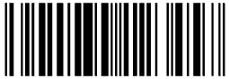

#  EAN13View

[](https://travis-ci.org/dkpoulsen/EAN13View)

### Barcode only

```swift
        let ean = try! EAN13(value: "5901234123457")
        let view = UIStackView(ean13: ean)
```

### Barcode with numeric display

```swift
        let ean = try! EAN13(value: "5901234123457")
        let view = EAN13View(ean13: ean)
```

